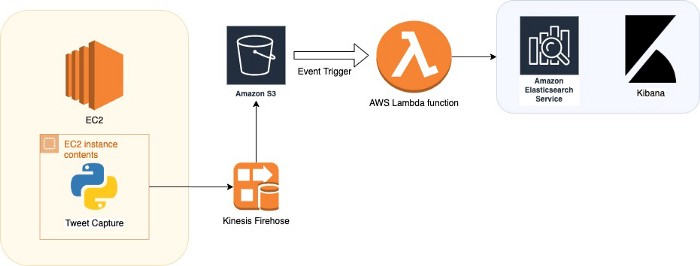
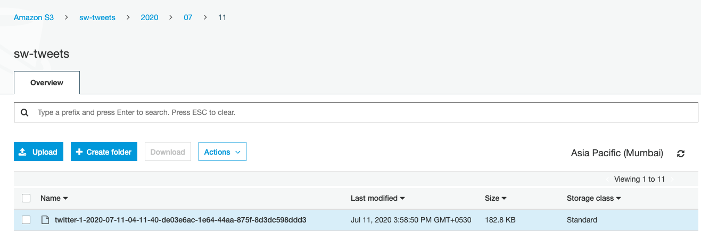
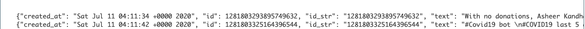
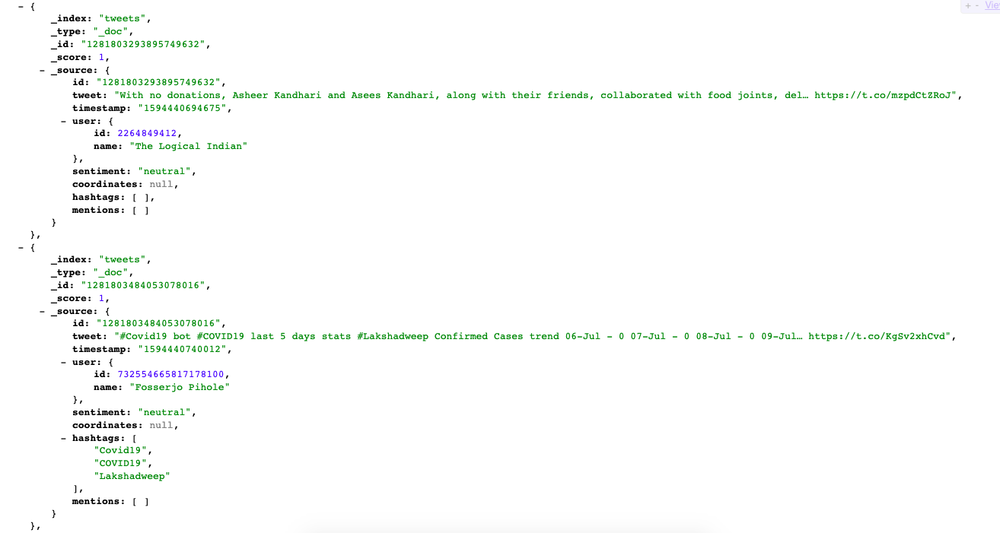

# Real time pipeline to analyze Twitter data

----
## Overview
This project is about how to build a data pipeline using big data technologies of AWS like **Kinesis Firehose, S3, Lambda, and Elasticsearch Service** to achieve real time sentiment and time series analysis on Twitter.

All of the resources have been created using this [Python script](https://github.com/shashankwadhwa9/twitter-realtime-sentiment-analysis/blob/master/src/create_aws_resources.py)

----
### Create S3 bucket
First we'll create a S3 bucket to hold our tweets data.

[Method](https://github.com/shashankwadhwa9/twitter-realtime-sentiment-analysis/blob/master/src/create_aws_resources.py#L10)

----
### Create Kinesis Firehose delivery stream
Amazon Kinesis Data Firehose is a fully managed service which automatically provisions, manages and scales compute, memory, and network resources required to load our streaming data. Once set up, Kinesis Data Firehose loads data continuously as it arrives to other AWS services like S3, Redshift etc.

While creating the delivery stream, we assign it an IAM role which has the permissions of s3 bucket we created in addition to the standard firehose permissions of PutLogEvents and kinesis ones.
([Permissions](https://github.com/shashankwadhwa9/twitter-realtime-sentiment-analysis/blob/master/src/create_aws_resources.py#L58))

We set the buffer interval to 15 minutes (900 seconds) and buffer size to 10mb. The condition satisfied first triggers data delivery to S3.

[Method](https://github.com/shashankwadhwa9/twitter-realtime-sentiment-analysis/blob/master/src/create_aws_resources.py#L32)

----
### Create lambda
Lambda plays a central role in this pipeline. We will create a Lambda function to do the following jobs:

* Once a new data file is created in the target S3 bucket, the Lambda function would be triggered.

* The lambda will then process the data by adding **sentiment** to it, convert it to a pre-defined schema and load it to the Elasticsearch cluster.

In this step though, we only create a basic function (without the code) to complete the pipeline. We'll add the code after a couple of steps once we have our Elasticsearch cluster ready.

Here's the method to [package our lambda](https://github.com/shashankwadhwa9/twitter-realtime-sentiment-analysis/blob/master/src/create_aws_resources.py#L151)

This creates a new virtualenv, installs all the requirements defined and packages all the modules and dependencies in a zip.

For creating the lambda we first create a role which has **ESHttpPost permission** since this lambda will be writing data to the ES cluster and also the **s3:GetObject** permission on our S3 bucket since this will be triggered whenever a new file is added in this bucket, hence we need the GetObject permission to read these files.

[Method](https://github.com/shashankwadhwa9/twitter-realtime-sentiment-analysis/blob/master/src/create_aws_resources.py#L176)

----
### Add trigger for S3 bucket
Next we add trigger on our S3 bucket. This would ensure that if any new file comes to the S3 bucket, the Lambda function would receive the event and get invocated.

One important thing here is to add the **resource policy for the lambda** to allow the S3 bucket to invoke this function.

[Method](https://github.com/shashankwadhwa9/twitter-realtime-sentiment-analysis/blob/master/src/create_aws_resources.py#L279)

----
### Create Elasticsearch cluster
ES will allow us to search and analyze big volumes of data quickly and in near real time. We can perform advanced search queries using ES and can even make a dashboard using * Kibana*.

For the ES policy, we give permission to the lambda's IAM role since lambda will write to this ES cluster.

Alongside we can optionally give permission to our local IP address for development and testing.

[Method](https://github.com/shashankwadhwa9/twitter-realtime-sentiment-analysis/blob/master/src/create_aws_resources.py#L316)

----
### Update the lambda function
Now that we have our pipline setup, we can add the code for our lambda. In this lambda, we read the tweets data off S3, process this data, add sentiment and finally load to ES (using bulk insert API) by converting it in a fixed schema.

[Method](https://github.com/shashankwadhwa9/twitter-realtime-sentiment-analysis/blob/master/src/create_aws_resources.py#L364)

[Lambda code](https://github.com/shashankwadhwa9/twitter-realtime-sentiment-analysis/tree/master/src/lambda)

----
### Consuming twitter streaming data
The final step in our pipeline is to listen to the Twitter streaming data and send to our Kinesis Firehose.

We achieve this using a python program which uses **StreamListener class from Tweepy module**. This script can run on an EC2 instance or on our local system, fetching the tweets filtered by a keyword/hashtag.

[Module](https://github.com/shashankwadhwa9/twitter-realtime-sentiment-analysis/blob/master/src/tweets_listener.py)

----
## Pipeline flow

